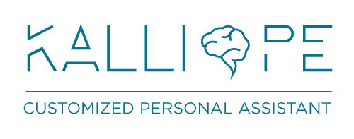

# Kalliope

[](https://travis-ci.org/kalliope-project/kalliope)
[](https://gitter.im/kalliope-project/Lobby)




Kalliope is a modular always-on voice controlled personal assistant designed for home automation.
Kalliope is based on audio input recognition, so it recognize an order pronounced by the user and then execute actions attached to the order.

You can create your own Kalliope bot, by simply choosing and composing the existing modules without writing any code. But, if you need a particular module, you can
write it by yourself and add it to your project. You can also propose it to the community.

Kalliope can run on all Linux Debian based distribution including a Raspberry Pi and it's multi-lang. The only thing you need is a microphone.

Kalliope is easy-peasy to use, see the hello world
```yml
  - name: "Hello-world"
    signals:
      - order: "say hello"
    neurons:      
      - say:
          message: "Hello world!"    
```

## Installation

- [Kalliope installation documentation](Docs/installation.md)

## Quick start

We made starter kits that only needs to be cloned and launched. Starter kits can help you to learn basics of Kalliope
- [French starter kit](https://github.com/kalliope-project/kalliope_starter_fr)
- [English starter kit](https://github.com/kalliope-project/kalliope_starter_en)

## Usage

- [Configure default settings](Docs/settings.md)
- [Create the brain of your Kalliope](Docs/brain.md)
- [Run Kalliope with CLI](Docs/kalliope_cli.md)

## Documentation summary

| Link                               | Detail                                                                                      |
|------------------------------------|---------------------------------------------------------------------------------------------|
| [Settings](Docs/settings.md)       | The main Kalliope configuration                                                             |
| [Brain](Docs/brain.md)             | What is the brain and how to create your own bot                                            |
| [neuron](Docs/neurons.md)          | What is a neuron and how to use it                                                          |
| [neuron list](Docs/neuron_list.md) | List of availlable neurons                                                                  |
| [CLI](Docs/kalliope_cli.md)        | How to use Kalliope from the command line interface                                         |
| [Signals](Docs/signals.md)         | Signals are input event that can wake up kalliope (spoken order, scheduled event, REST API) |
| [STT](Docs/stt.md)                 | Speech to text configuration                                                                |
| [TTS](Docs/tts.md)                 | Text to speech configuration                                                                |
| [Triggers](Docs/trigger.md)        | Magic hotword engine used to make Kalliope listtening for an order                          |
| [REST API](Docs/rest_api.md)       | Integrated REST API. Can be used to send an order                                           |

## Contributing

If you'd like to contribute to Kalliope, please read our [Contributing Guide](Docs/contributing.md), which contains the philosophies to preserve, tests to run, and more. 
Reading through this guide before writing any code is recommended.

- Read the [contributing guide](Docs/contributing.md)
- Add [issues and feature requests](../../issues)

## Credits

> **Meaning of Kalliope** Kalliope means "beautiful voice" from Greek καλλος (kallos) "beauty" and οψ (ops) "voice". 
In Greek mythology she was a goddess of epic poetry and eloquence, one of the nine Muses.
PRONOUNCED: kə-LIE-ə-pee (English) 
PRONOUNCED: Ka-li-o-pé (French)
PRONOUNCED: каллиопа (Russian)

## Links

Demo French   : [video](https://www.youtube.com/watch?v=t4J42yO2rkM)
Demo English  : [video](https://www.youtube.com/watch?v=PcLzo4H18S4)

## License

Copyright (c) 2016. All rights reserved.

Kalliope is covered by the MIT license, a permissive free software license that lets you do anything you want with the source code, 
as long as you provide back attribution and ["don't hold you liable"](http://choosealicense.com/). For the full license text see the [LICENSE.md](LICENSE.md) file.
