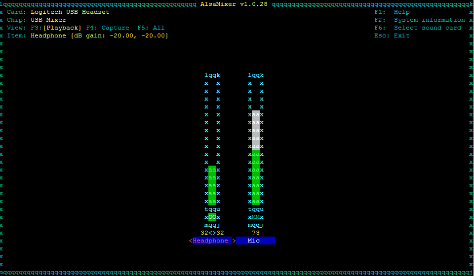

# Kalliope requirements for Raspbian

Kalliope can be installed:

- [Via the pre-compiled disk image](#install-via-the-pre-compiled-disk-image)
- [Via script](#install-via-script)
- [Manually](#manual-installation)


## Install via the pre-compiled disk image

Download the last image [from the release page](https://github.com/kalliope-project/kalliope/releases) of Kalliope and load it as usual onto an SD card.

- **Login:** pi
- **Password:** raspberry

Once installed, use the `raspi-config` command to expand the file system and fill the available space on the SD card.
The SSH server is enable by default. Get the IP of your Rpi via the command `ip a` and then connect via your favourite SSH client.

You'll find a couple folders named "starter_kit_<language>" located in `/home/pi`. Those folders are basic configuration that will help you to start with Kalliope.


## Install via script

Just run the following bash command to install Kalliope on a freshly installed Raspberry Pi:
```
bash -c "$(curl -sL https://raw.githubusercontent.com/kalliope-project/kalliope/master/install/rpi_install_kalliope.sh)"
```

## Manual installation

> **Note:** It is recommended to use a **lite** installation of Raspbian without any graphical interface for a better experience.

> **Note:** The first Raspberry Pi is not officially supported. The installation will works but a single core with only 700Mhz may produce latency.

### Debian packages requirements

Install the required system libraries and software:

```bash
sudo apt-get update
sudo apt-get install git python-dev libttspico-utils libsmpeg0 flac \
portaudio19-dev build-essential libssl-dev libffi-dev sox libatlas3-base mplayer \
libyaml-dev libpython2.7-dev libav-tools libjpeg-dev ffmpeg
```

On Raspbian **Buster**, the default TTS engine is not installable directly from the package manager. Run command below to install it manually:
```
wget http://ftp.fr.debian.org/debian/pool/non-free/s/svox/libttspico-utils_1.0+git20130326-9_armhf.deb
wget http://ftp.fr.debian.org/debian/pool/non-free/s/svox/libttspico0_1.0+git20130326-9_armhf.deb
wget http://ftp.fr.debian.org/debian/pool/non-free/s/svox/libttspico-data_1.0+git20130326-9_all.deb
sudo dpkg -i libttspico-data_1.0+git20130326-9_all.deb
sudo dpkg -i libttspico-utils_1.0+git20130326-9_armhf.deb
sudo dpkg -i libttspico0_1.0+git20130326-9_armhf.deb
```

Install the last release of python-pip:
```bash
wget https://bootstrap.pypa.io/get-pip.py
sudo python get-pip.py
```

{!installation/manual_installation_common.md!}

## Raspberry Pi configuration

This section deals with the special configuration needed to get kalliope working on a RPi.

### Microphone configuration

Get the output card:
```bash
aplay -l
```

Output example with a USB headset connected:
```bash
**** List of PLAYBACK Hardware Devices ****
card 0: ALSA [bcm2835 ALSA], device 0: bcm2835 ALSA [bcm2835 ALSA]
  Subdevices: 7/8
  Subdevice #0: subdevice #0
  Subdevice #1: subdevice #1
  Subdevice #2: subdevice #2
  Subdevice #3: subdevice #3
  Subdevice #4: subdevice #4
  Subdevice #5: subdevice #5
  Subdevice #6: subdevice #6
  Subdevice #7: subdevice #7
card 0: ALSA [bcm2835 ALSA], device 1: bcm2835 ALSA [bcm2835 IEC958/HDMI]
  Subdevices: 1/1
  Subdevice #0: subdevice #0
card 1: Headset [Logitech USB Headset], device 0: USB Audio [USB Audio]
  Subdevices: 0/1
  Subdevice #0: subdevice #0
```

Here we see that:

- the analog audio (where the jack is connected) on card 0 and device 1
- usb audio on card 1 and device 1


Get the input (microphone card):
```bash
arecord -l
```

Output example with a USB headset connected:
```bash
**** List of CAPTURE Hardware Devices ****
card 1: Headset [Logitech USB Headset], device 0: USB Audio [USB Audio]
  Subdevices: 0/1
  Subdevice #0: subdevice #0
```

Here one shall see one peripheral on card 1 and device 0

Create a configuration file that applies the following configuration:

- output audio (what Kalliope says) on the analog audio (via speakers connected to the jack)
- input audio (what is said to Kalliope) on the USB microphone

Create a file in `/home/pi/.asoundrc` with the content below
```
pcm.!default {
   type asym
   playback.pcm {
     type plug
     slave.pcm "hw:0,0"
   }
   capture.pcm {
     type plug
     slave.pcm "hw:1,0"
   }
}
```

Where `playback.pcm` is the output audio and the `capture.pcm` is the input audio.

Restart alsa to apply changes:
```bash
sudo /etc/init.d/alsa-utils restart
```

Adjust the microphone sensibility by running alsamixer:
```bash
alsamixer
```

Select the microphone device by pressing F6 and move up the `mic` sensibility level:


### HDMI / Analog audio

By default, the audio stream will use HDMI if something is plugged into this port.
Check the [official documentation](https://www.raspberrypi.org/documentation/configuration/audio-config.md) to switch from HDMI to analog.

```bash
sudo raspi-config
```

### Configure your locales

Locales defines language and country specific setting for your programs and shell session. 
To set system’s locale you need use shell variable. For example, LANG variable can be used to set en_US (English US) language. 

Check current locales:
```
locale
```

To update your locale, type the command bellow:
```
sudo dpkg-reconfigure locales
```

Select in the list the locales of your country, by selecting the code with UTF8, example:

- de_DE.utf8
- en_GB.utf8
- fr_FR.utf8
- es_ES.utf8

Then, update your `/home/pi/.bashrc` file by exporting the language. Example:
```
export LC_ALL="en_US.UTF-8"
export LANG="en_US.UTF-8"
export LANGUAGE="en_US.UTF-8"
```

Source the file to handle changes
```
source /home/pi/.bashrc
```

{!installation/check_env.md!}
